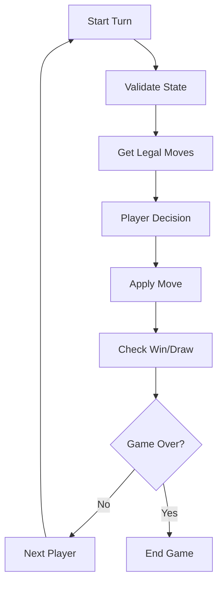

# Haive Games Architecture

This document explains the architecture and design patterns used in the Haive Games package.

## Overview

The Haive Games package follows a consistent architecture pattern across all games, built on top of the Haive agent framework. Each game implements a state-based agent system with LangGraph for orchestration.

## Core Components

### 1. Game Agent

Each game has a main agent class that inherits from `Agent[ConfigType]`:

```python
from haive.core.engine.agent.agent import Agent, register_agent

@register_agent(ChessConfig)
class ChessAgent(Agent[ChessConfig]):
    def __init__(self, config: ChessConfig):
        super().__init__(config)
        self.setup_workflow()

    def setup_workflow(self):
        # Define game flow with LangGraph
        pass
```

### 2. Game Configuration

Configuration classes inherit from `AgentConfig` and define game-specific settings:

```python
from haive.core.engine.agent.config import AgentConfig
from pydantic import Field

class ChessConfig(AgentConfig):
    max_moves: int = Field(default=200, description="Maximum moves before draw")
    time_limit: int = Field(default=300, description="Time limit per player in seconds")
    aug_llm_configs: dict[str, LLMConfig] = Field(
        description="LLM configurations for each player"
    )
```

### 3. Game State

States are Pydantic models that represent the complete game state:

```python
from pydantic import BaseModel

class ChessState(BaseModel):
    board: List[List[Optional[Piece]]]
    current_player: Literal["white", "black"]
    castling_rights: Dict[str, bool]
    en_passant_target: Optional[str]
    halfmove_clock: int
    fullmove_number: int
    game_over: bool = False
    winner: Optional[str] = None
```

### 4. State Manager

State managers handle game logic and state transitions:

```python
class ChessStateManager:
    @staticmethod
    def initialize() -> ChessState:
        """Create initial game state"""
        pass

    @staticmethod
    def apply_move(state: ChessState, move: ChessMove) -> ChessState:
        """Apply a move and return new state"""
        pass

    @staticmethod
    def get_legal_moves(state: ChessState) -> List[ChessMove]:
        """Get all legal moves for current player"""
        pass
```

## Game Flow Architecture

### LangGraph Integration

Games use LangGraph to define their execution flow:

```python
def setup_workflow(self):
    # Add nodes
    self.graph.add_node("validate_state", self.validate_state)
    self.graph.add_node("get_player_move", self.get_player_move)
    self.graph.add_node("apply_move", self.apply_move)
    self.graph.add_node("check_game_over", self.check_game_over)

    # Define flow
    self.graph.set_entry_point("validate_state")
    self.graph.add_edge("validate_state", "get_player_move")
    self.graph.add_edge("get_player_move", "apply_move")
    self.graph.add_edge("apply_move", "check_game_over")

    # Conditional routing
    self.graph.add_conditional_edges(
        "check_game_over",
        self.route_game_state,
        {
            "continue": "get_player_move",
            "game_over": END
        }
    )
```

### Node Pattern

Each node follows a consistent pattern:

```python
def get_player_move(self, state: GameState) -> Command:
    """Node that gets the next move from the current player."""
    current_player = state.current_player

    # Get LLM config for player
    llm_config = self.config.aug_llm_configs[current_player]

    # Create prompt
    prompt = self.create_move_prompt(state)

    # Get move from LLM
    move = self.engines[current_player].invoke(prompt)

    # Return update command
    return Command(update={"last_move": move})
```

## Design Patterns

### 1. Multi-Player Games

Multi-player games use a common base class:

```python
from haive.games.framework.multi_player import MultiPlayerGameAgent

class PokerAgent(MultiPlayerGameAgent[PokerConfig]):
    def get_current_player_engine(self, state: PokerState) -> AugLLM:
        """Get the engine for the current player"""
        return self.engines[f"player_{state.current_player_index}"]
```

### 2. Turn-Based Games

Turn-based games implement a standard flow:



### 3. Hidden Information Games

Games with hidden information (poker, mafia) use view filtering:

```python
def get_player_view(self, state: GameState, player: str) -> PlayerView:
    """Get the view of the game state for a specific player"""
    # Filter out hidden information
    visible_cards = [c for c in state.cards if c.visible_to(player)]
    return PlayerView(
        visible_cards=visible_cards,
        player_hand=state.hands[player],
        public_info=state.public_info
    )
```

### 4. Simultaneous Action Games

Some games allow simultaneous actions:

```python
def collect_all_actions(self, state: GameState) -> Dict[str, Action]:
    """Collect actions from all players simultaneously"""
    tasks = []
    for player in state.active_players:
        task = self.get_player_action_async(state, player)
        tasks.append(task)

    # Wait for all players
    actions = await asyncio.gather(*tasks)
    return dict(zip(state.active_players, actions))
```

## Common Interfaces

### Game Agent Interface

All game agents implement these methods:

```python
class GameAgent(Agent[ConfigType]):
    def get_initial_state(self) -> GameState:
        """Get the initial game state"""

    def visualize_state(self, state: GameState) -> str:
        """Return a string visualization of the state"""

    def get_winner(self, state: GameState) -> Optional[str]:
        """Determine the winner from final state"""
```

### Move Validation

All games implement move validation:

```python
def validate_move(self, state: GameState, move: Move) -> bool:
    """Check if a move is legal"""
    legal_moves = self.get_legal_moves(state)
    return move in legal_moves
```

### State Transitions

State transitions are immutable:

```python
def apply_move(self, state: GameState, move: Move) -> GameState:
    """Apply move and return NEW state (immutable)"""
    new_state = state.model_copy(deep=True)
    # Modify new_state
    return new_state
```

## LLM Integration

### Engine Configuration

Games use augmented LLMs with structured output:

```python
from haive.core.engine.aug_llm import AugLLM, AugLLMConfig

# Configure engine with structured output
engine_config = AugLLMConfig(
    llm_config=player_llm_config,
    prompts=[chess_move_prompt],
    output_schemas=[ChessMove]
)

engine = AugLLM.from_config(engine_config)
```

### Prompt Engineering

Games use carefully crafted prompts:

```python
chess_prompt = PromptTemplate(
    template="""You are playing chess as {color}.

Current board state:
{board_ascii}

FEN: {fen}
Legal moves: {legal_moves}

Recent moves:
{move_history}

Choose your next move. Consider:
- Material balance
- Piece positioning
- King safety
- Tactical opportunities

Respond with your chosen move in algebraic notation.""",
    input_variables=["color", "board_ascii", "fen", "legal_moves", "move_history"]
)
```

## Error Handling

### Graceful Degradation

Games handle errors gracefully:

```python
def get_player_move_with_retry(self, state: GameState) -> Move:
    max_retries = 3
    for attempt in range(max_retries):
        try:
            move = self.get_player_move(state)
            if self.validate_move(state, move):
                return move
        except Exception as e:
            logger.warning(f"Move generation failed: {e}")

    # Fallback to random legal move
    return random.choice(self.get_legal_moves(state))
```

### State Recovery

Games can recover from invalid states:

```python
def validate_and_repair_state(self, state: GameState) -> GameState:
    """Validate state and repair if possible"""
    issues = self.find_state_issues(state)

    if not issues:
        return state

    # Attempt repairs
    repaired_state = state.model_copy()
    for issue in issues:
        repaired_state = self.repair_issue(repaired_state, issue)

    return repaired_state
```

## Performance Optimization

### State Caching

Games cache expensive computations:

```python
from functools import lru_cache

@lru_cache(maxsize=1000)
def get_legal_moves_cached(board_hash: str) -> List[Move]:
    """Cache legal move generation"""
    board = deserialize_board(board_hash)
    return calculate_legal_moves(board)
```

### Parallel Processing

Multi-player games can process in parallel:

```python
async def process_simultaneous_phase(self, state: GameState):
    """Process all players simultaneously"""
    tasks = []

    for player in state.active_players:
        task = asyncio.create_task(
            self.process_player_action(state, player)
        )
        tasks.append(task)

    results = await asyncio.gather(*tasks)
    return self.merge_results(state, results)
```

## Testing Patterns

### Unit Testing

Each component is independently testable:

```python
def test_legal_move_generation():
    state = ChessState.from_fen("rnbqkbnr/pppppppp/8/8/8/8/PPPPPPPP/RNBQKBNR w KQkq - 0 1")
    moves = ChessStateManager.get_legal_moves(state)
    assert len(moves) == 20  # Initial position has 20 legal moves
```

### Integration Testing

Full game flows are tested:

```python
async def test_complete_game():
    config = ChessConfig(
        aug_llm_configs={
            "white": mock_llm_config,
            "black": mock_llm_config
        }
    )

    agent = ChessAgent(config)
    initial_state = agent.get_initial_state()

    final_state = None
    async for state in agent.app.astream(initial_state):
        final_state = state
        if state.game_over:
            break

    assert final_state.winner in ["white", "black", "draw"]
```

## Extension Points

### Creating New Games

Follow these steps to add a new game:

1. Create game directory: `src/haive/games/your_game/`
2. Implement core files:
   - `__init__.py` - Package exports
   - `config.py` - Game configuration
   - `agent.py` - Main game agent
   - `state.py` - Game state model
   - `models.py` - Move/action models
   - `state_manager.py` - Game logic

3. Register the agent:

```python
@register_agent(YourGameConfig)
class YourGameAgent(Agent[YourGameConfig]):
    pass
```

4. Add to game registry for automatic discovery
